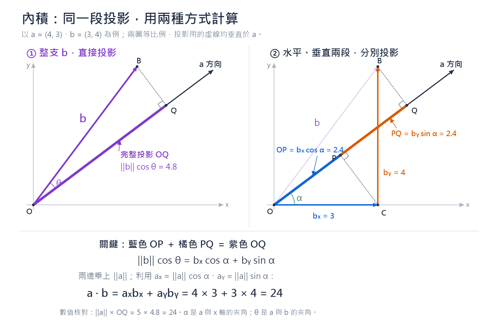
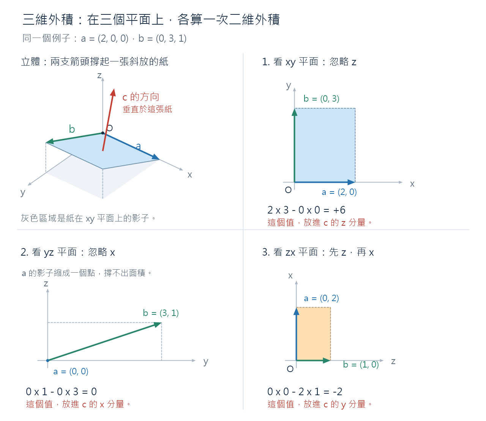
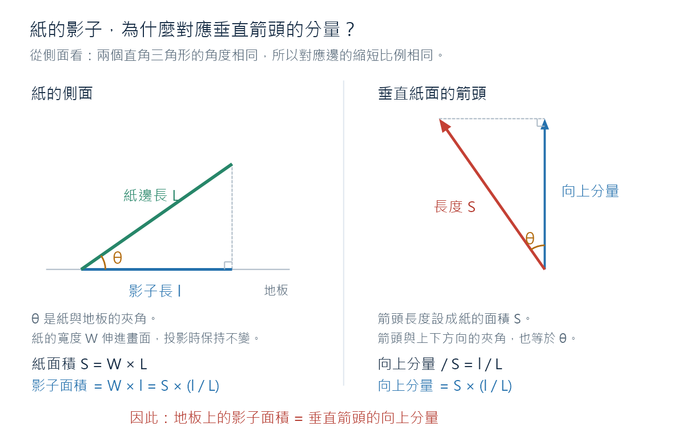
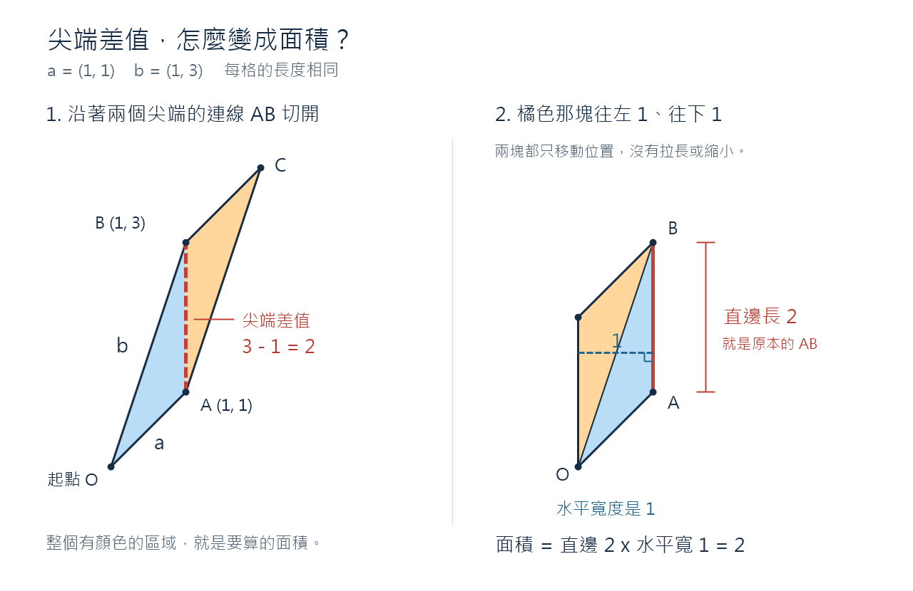

# 補充：內積與叉積的公式、幾何意義與證明

> 搭配 [2.2 矩陣](2.2_matrices.md) 閱讀。先認識結果，再用投影與面積理解公式，最後驗證座標公式為什麼成立。
> 本篇限定實數向量、標準正交座標下的 **inner product（內積／點積）** 與右手座標系中的三維 **cross product（叉積／向量外積）**。「外積」在此指 cross product，不是 outer product。

## 1. 先分清楚：數字與向量

以下把向量視為欄向量，$\|\boldsymbol a\|=\sqrt{\sum_i a_i^2}$ 表示長度。兩個**非零向量**尾端放在同一點時，夾角記為 $\theta\in[0,\pi]$。

| 比較 | 內積 inner product | 叉積 cross product |
| --- | --- | --- |
| 記號 | $\boldsymbol a\cdot\boldsymbol b=\boldsymbol a^\top\boldsymbol b$ | $\boldsymbol a\times\boldsymbol b$ |
| 本篇適用維度 | 兩向量都在 $\mathbb R^n$ | 兩向量都在 $\mathbb R^3$ |
| 結果 | 純量，一個有正負號的數字 | 三維向量 |
| 幾何公式 | $\boldsymbol a\cdot\boldsymbol b=\|\boldsymbol a\|\|\boldsymbol b\|\cos\theta$ | $\|\boldsymbol a\times\boldsymbol b\|=\|\boldsymbol a\|\|\boldsymbol b\|\sin\theta$ |
| 幾何意義 | 一個向量的長度 × 另一個沿它方向的帶號投影長度 | 長度是平行四邊形面積；方向由右手定則選定 |
| 交換順序 | 不變 | 變成相反向量 |
| 結果為零 | 非零向量互相垂直，或至少一個是零向量 | 非零向量互相平行，或至少一個是零向量 |

**內積本身是數字；叉積公式中的範數只取結果的長度，完整的叉積還有方向。** 若其中一個是零向量，仍可使用座標公式，但夾角沒有定義。

## 2. 內積：沿著同一方向，有多少分量？

### 2.1 公式

標準 Euclidean inner product 的座標定義是：

$$
\boxed{\boldsymbol a\cdot\boldsymbol b=\sum_{i=1}^{n}a_i b_i}
$$

二維與三維分別寫成：

$$
\boldsymbol a\cdot\boldsymbol b=a_xb_x+a_yb_y,
\qquad
\boldsymbol a\cdot\boldsymbol b=a_xb_x+a_yb_y+a_zb_z.
$$

對非零向量，它也等於：

$$
\boxed{\boldsymbol a\cdot\boldsymbol b
=\|\boldsymbol a\|\,\|\boldsymbol b\|\cos\theta}
$$

本節要說明：**為什麼「對應分量相乘再相加」和「長度乘上投影」是同一件事？**

### 2.2 幾何意義：長度 × 帶正負號的影子

把 $\boldsymbol a$ 的方向當成一條有正方向的直線。$\boldsymbol b$ 沿這個方向的帶號投影長度為：

$$
s=\|\boldsymbol b\|\cos\theta,
\qquad
\boldsymbol a\cdot\boldsymbol b=\|\boldsymbol a\|\,s.
$$

| 夾角 | 投影方向 | 內積 |
| --- | --- | --- |
| $0^\circ\leq\theta<90^\circ$ | 朝 $\boldsymbol a$ 的正方向 | 正 |
| $\theta=90^\circ$ | 投影長度為 0 | 0 |
| $90^\circ<\theta\leq180^\circ$ | 朝 $\boldsymbol a$ 的反方向 | 負 |

普通的線段長度不會是負數，但**帶號投影**可以。這裡的「影子」必須保留正負號。

例如恆力 $\boldsymbol F$ 使物體產生位移 $\boldsymbol d$ 時，做功為 $W=\boldsymbol F\cdot\boldsymbol d$。沿位移方向的力做正功，反向的力做負功，垂直於位移的力做零功。

### 2.3 圖解證明：整支箭頭的投影 = 各段投影相加

圖中使用：

$$
\boldsymbol a=(4,3),\qquad \boldsymbol b=(3,4),\qquad \|\boldsymbol a\|=\|\boldsymbol b\|=5.
$$



$\alpha$ 是 **$\boldsymbol a$ 與正 $x$ 軸的夾角**；$\theta$ 才是 **$\boldsymbol a$ 與 $\boldsymbol b$ 的夾角**。

- $O=(0,0)$ 是起點，$B=(b_x,b_y)$ 是 $\boldsymbol b$ 的尖端。
- $C=(b_x,0)$：從 $O$ 水平走到 $C$，再垂直走到 $B$，總位移就是 $\boldsymbol b$。
- $C$ 垂直投影到 $\boldsymbol a$ 所在直線，得到 $P$；$B$ 投影後得到 $Q$。
- 藍色 $OP$ 是水平段 $OC$ 的投影；橘色 $PQ$ 是垂直段 $CB$ 的投影。

**圖形核對：$CP\perp\boldsymbol a$、$BQ\perp\boldsymbol a$，且 $O,P,Q$ 共線。藍色必須在 $P$ 結束，橘色必須從 $P$ 開始。**

令 $A=\|\boldsymbol a\|$。由 $\boldsymbol a$ 的水平、垂直分量：

$$
a_x=A\cos\alpha,\qquad a_y=A\sin\alpha.
$$

由直角三角形可得：

$$
OP=b_x\cos\alpha,\qquad
PQ=b_y\cos(90^\circ-\alpha)=b_y\sin\alpha.
$$

為什麼投影可以相加？投影後的兩段仍然首尾相接：$OC$ 的終點 $C$ 和 $CB$ 的起點 $C$ 都落在同一個 $P$。沿著同一直線走 $OP$ 再走 $PQ$，就是走完 $OQ$。

所以同一段完整投影可以寫成：

$$
\underbrace{\|\boldsymbol b\|\cos\theta}_{OQ}
=\underbrace{b_x\cos\alpha}_{OP}
+\underbrace{b_y\sin\alpha}_{PQ}.
$$

兩邊乘上 $A$：

$$
\begin{aligned}
\|\boldsymbol a\|\,\|\boldsymbol b\|\cos\theta
&=b_x(A\cos\alpha)+b_y(A\sin\alpha)\\
&=a_xb_x+a_yb_y.
\end{aligned}
$$

這就是「對應分量相乘再相加」的幾何來源。圖示選用第一象限且 $P$ 在 $O,Q$ 之間的例子；其他方向要使用**帶號投影**，此時沿 $\boldsymbol a$ 正方向計算的 $OP+PQ=OQ$ 仍成立，不能把每一段都取絕對值。

本例 $\cos\alpha=4/5$、$\sin\alpha=3/5$，因此：

$$
OP=3\cdot\frac45=2.4,\quad
PQ=4\cdot\frac35=2.4,\quad OQ=4.8,
$$

$$
\boldsymbol a\cdot\boldsymbol b=5\times4.8
=4\times3+3\times4=24.
$$

投影點為 $P=(1.92,1.44)$、$Q=(3.84,2.88)$。圖以這些座標等比例繪製。

### 2.4 一般維度的證明：同一段距離，用兩種方式計算

把 $\boldsymbol a$、$\boldsymbol b$ 的尾端放在原點，兩個尖端之間的距離是 $\|\boldsymbol a-\boldsymbol b\|$。

用座標與畢氏定理計算：

$$
\begin{aligned}
\|\boldsymbol a-\boldsymbol b\|^2
&=\sum_i(a_i-b_i)^2\\
&=\|\boldsymbol a\|^2+\|\boldsymbol b\|^2-2\sum_i a_i b_i.
\end{aligned}
$$

用原點與兩個尖端形成的三角形，以及幾何上的餘弦定理計算：

$$
\|\boldsymbol a-\boldsymbol b\|^2
=\|\boldsymbol a\|^2+\|\boldsymbol b\|^2
-2\|\boldsymbol a\|\,\|\boldsymbol b\|\cos\theta.
$$

比較兩式，消去相同的平方項，得到：

$$
\boxed{\sum_i a_i b_i=\|\boldsymbol a\|\,\|\boldsymbol b\|\cos\theta}
$$

兩個不平行向量總能張成一個平面，所以三角形的論證也適用於 $\mathbb R^n$。非零的同向、反向向量可直接代入驗證。此處用幾何上的夾角與餘弦定理，沒有先以內積定義夾角再繞回來證明。

### 2.5 投影長度、投影向量與相似度要分開

對 $\boldsymbol a\ne\boldsymbol0$，帶號投影長度是純量：

$$
s=\frac{\boldsymbol a\cdot\boldsymbol b}{\|\boldsymbol a\|}.
$$

投影向量則是「帶號長度 × 單位方向」：

$$
\operatorname{proj}_{\boldsymbol a}\boldsymbol b
=s\frac{\boldsymbol a}{\|\boldsymbol a\|}
=\frac{\boldsymbol a\cdot\boldsymbol b}{\|\boldsymbol a\|^2}\boldsymbol a.
$$

本例的投影向量是 $\overrightarrow{OQ}=(3.84,2.88)$；它的長度為 4.8，內積則是 24。

只比較非零向量的方向時，使用：

$$
\operatorname{cosine\ similarity}(\boldsymbol a,\boldsymbol b)
=\frac{\boldsymbol a\cdot\boldsymbol b}{\|\boldsymbol a\|\,\|\boldsymbol b\|}
=\cos\theta.
$$

內積同時受到角度與長度影響，不能只看到 24 就判定「非常相似」。本例的 cosine similarity 是 $24/25=0.96$。

### 2.6 基本性質與簡短證明

以下性質直接來自座標定義：

$$
\begin{aligned}
\boldsymbol a\cdot\boldsymbol b
&=\sum_i a_i b_i=\sum_i b_i a_i=\boldsymbol b\cdot\boldsymbol a,\\
\boldsymbol a\cdot(\lambda\boldsymbol b+\mu\boldsymbol c)
&=\sum_i a_i(\lambda b_i+\mu c_i)
=\lambda(\boldsymbol a\cdot\boldsymbol b)+\mu(\boldsymbol a\cdot\boldsymbol c),\\
\boldsymbol a\cdot\boldsymbol a&=\sum_i a_i^2=\|\boldsymbol a\|^2\geq0.
\end{aligned}
$$

最後一式等於 0，恰好在 $\boldsymbol a=\boldsymbol0$ 時成立。這些性質稱為對稱性、線性、正定性；本篇的點積是一般內積的一個具體例子。

## 3. 叉積：用一支向量記錄面積與朝向

### 3.1 公式

對右手正交座標系中的 $\boldsymbol a,\boldsymbol b\in\mathbb R^3$，定義：

$$
\boxed{
\boldsymbol a\times\boldsymbol b=
\begin{bmatrix}
a_yb_z-a_zb_y\\
a_zb_x-a_xb_z\\
a_xb_y-a_yb_x
\end{bmatrix}}
$$

完整的幾何形式是：

$$
\boxed{\boldsymbol a\times\boldsymbol b
=\bigl(\|\boldsymbol a\|\,\|\boldsymbol b\|\sin\theta\bigr)\boldsymbol n}
$$

$\boldsymbol n$ 是垂直於兩向量所張平面的**單位法向量**，朝向由右手定則決定。此式先假設兩向量非零且不平行；平行或含零向量時，座標公式給出零向量。

### 3.2 幾何意義：底 × 高，再指定垂直方向

兩向量張出的平行四邊形，以 $\boldsymbol a$ 為底時：

$$
\text{底長}=\|\boldsymbol a\|,\qquad
h=\|\boldsymbol b\|\sin\theta,
$$

$$
S=\|\boldsymbol a\|h
=\|\boldsymbol a\|\,\|\boldsymbol b\|\sin\theta.
$$

叉積把面積 $S$ 當作向量的長度，用法向方向記錄平面的朝向：

$$
\|\boldsymbol a\times\boldsymbol b\|=S,
\qquad
\text{三角形面積}=\frac12\|\boldsymbol a\times\boldsymbol b\|.
$$

**高 $h$ 是 $\boldsymbol b$ 的尖端到 $\boldsymbol a$ 所在「整條直線」的垂直距離。** 垂足可以在線段延長線上；高通常不等於兩箭頭尖端的距離 $\|\boldsymbol b-\boldsymbol a\|$。

非平行時，將右手四指從 $\boldsymbol a$ 朝 $\boldsymbol b$ 沿小於 $180^\circ$ 的角度彎曲，拇指指向叉積方向。面積只決定長度，「垂直」只決定一條法線；還需要右手定則選定法線的哪一側。

### 3.3 圖解：三組「乘積相減」是三個平面的有向面積

先看二維向量 $\boldsymbol u=(u_x,u_y)$、$\boldsymbol v=(v_x,v_y)$。設它們相對正 $x$ 軸的方向角為 $\beta,\gamma$：

$$
\boldsymbol u=r(\cos\beta,\sin\beta),\qquad
\boldsymbol v=s(\cos\gamma,\sin\gamma).
$$

由三角恆等式：

$$
\begin{aligned}
u_xv_y-u_yv_x
&=rs(\cos\beta\sin\gamma-\sin\beta\cos\gamma)\\
&=rs\sin(\gamma-\beta).
\end{aligned}
$$

$|u_xv_y-u_yv_x|$ 因此是平行四邊形面積；正負號記錄從第一支向量轉向第二支向量的平面朝向。這個純量稱為**二維行列式／有向面積**，不是三維叉積的完整向量。

三維叉積的三個分量，正好分別是三個座標平面上的有向投影面積：

| 投影平面與座標順序 | 有向面積 | 叉積的分量 |
| --- | --- | --- |
| $yz$，先 $y$ 再 $z$ | $a_yb_z-a_zb_y$ | $x$ 分量 |
| $zx$，先 $z$ 再 $x$ | $a_zb_x-a_xb_z$ | $y$ 分量 |
| $xy$，先 $x$ 再 $y$ | $a_xb_y-a_yb_x$ | $z$ 分量 |

順序採 $x\to y\to z\to x$ 的循環，對應右手座標系。特別注意：$y$ 分量用的是 **$zx$** 的順序；若改用 $xz$ 的行列式，就要加負號。



圖中 $\boldsymbol a=(2,0,0)$、$\boldsymbol b=(0,3,1)$，因此：

$$
\boldsymbol a\times\boldsymbol b=(0,-2,6),\qquad
\|\boldsymbol a\times\boldsymbol b\|=\sqrt{0^2+(-2)^2+6^2}=2\sqrt{10}.
$$

三個投影面積是同一塊平面在不同座標平面的影子，**不是三塊可直接相加的面積**。原面積是叉積的長度，要平方相加再開根號。

> 圖中「二維外積」指上面的二維行列式／有向面積；立體圖中的紅箭頭只標示法向方向。

### 3.4 代數推導：從基底規則得到座標公式

右手座標系的單位基底為 $\boldsymbol e_x=(1,0,0)$、$\boldsymbol e_y=(0,1,0)$、$\boldsymbol e_z=(0,0,1)$。規定：

$$
\boldsymbol e_x\times\boldsymbol e_y=\boldsymbol e_z,\quad
\boldsymbol e_y\times\boldsymbol e_z=\boldsymbol e_x,\quad
\boldsymbol e_z\times\boldsymbol e_x=\boldsymbol e_y.
$$

順序交換後加負號，同方向與自身的叉積為零，並用對兩邊各自的線性延伸到所有向量。這些是定義規則；下面再驗證它們確實產生所需的垂直方向與面積。

將 $\boldsymbol a=a_x\boldsymbol e_x+a_y\boldsymbol e_y+a_z\boldsymbol e_z$ 與 $\boldsymbol b$ 展開，九項中同方向的三項為零，剩下：

$$
\begin{aligned}
\boldsymbol a\times\boldsymbol b
={}&a_xb_y\boldsymbol e_z-a_xb_z\boldsymbol e_y
-a_yb_x\boldsymbol e_z\\
&+a_yb_z\boldsymbol e_x+a_zb_x\boldsymbol e_y-a_zb_y\boldsymbol e_x\\
={}&(a_yb_z-a_zb_y)\boldsymbol e_x
+(a_zb_x-a_xb_z)\boldsymbol e_y
+(a_xb_y-a_yb_x)\boldsymbol e_z.
\end{aligned}
$$

這就得到 §3.1 的座標公式。

### 3.5 證明一：結果為什麼垂直於兩個向量？

令 $\boldsymbol c=\boldsymbol a\times\boldsymbol b$，直接計算：

$$
\begin{aligned}
\boldsymbol a\cdot\boldsymbol c
&=a_x(a_yb_z-a_zb_y)+a_y(a_zb_x-a_xb_z)+a_z(a_xb_y-a_yb_x)\\
&=a_xa_yb_z-a_xa_zb_y+a_ya_zb_x-a_xa_yb_z+a_xa_zb_y-a_ya_zb_x\\
&=0,\\
\boldsymbol b\cdot\boldsymbol c
&=b_x(a_yb_z-a_zb_y)+b_y(a_zb_x-a_xb_z)+b_z(a_xb_y-a_yb_x)\\
&=a_yb_xb_z-a_zb_xb_y+a_zb_xb_y-a_xb_yb_z+a_xb_yb_z-a_yb_xb_z\\
&=0.
\end{aligned}
$$

每一項都有相同大小、相反符號的另一項，全部抵消。前面已證明：兩個非零向量的內積為零，代表夾角是 $90^\circ$。因此當 $\boldsymbol c\ne\boldsymbol0$，它同時垂直於 $\boldsymbol a$ 和 $\boldsymbol b$。

### 3.6 證明二：長度為什麼等於平行四邊形面積？

由座標公式：

$$
\|\boldsymbol c\|^2
=(a_yb_z-a_zb_y)^2+(a_zb_x-a_xb_z)^2+(a_xb_y-a_yb_x)^2.
$$

展開三個平方，六個平方項是 $\sum_{i\ne j}a_i^2b_j^2$，三組交叉項是 $-2\sum_{i<j}a_i a_j b_i b_j$，所以：

$$
\|\boldsymbol c\|^2
=\sum_{i\ne j}a_i^2b_j^2-2\sum_{i<j}a_i a_j b_i b_j.
$$

另一方面：

$$
\begin{aligned}
\|\boldsymbol a\|^2\|\boldsymbol b\|^2-(\boldsymbol a\cdot\boldsymbol b)^2
&=\sum_{i,j}a_i^2b_j^2
-\left(\sum_i a_i^2b_i^2+2\sum_{i<j}a_i a_j b_i b_j\right)\\
&=\sum_{i\ne j}a_i^2b_j^2-2\sum_{i<j}a_i a_j b_i b_j.
\end{aligned}
$$

兩個展開式相同，得到：

$$
\boxed{\|\boldsymbol a\times\boldsymbol b\|^2
=\|\boldsymbol a\|^2\|\boldsymbol b\|^2-(\boldsymbol a\cdot\boldsymbol b)^2}
$$

代入已證明的內積公式：

$$
\begin{aligned}
\|\boldsymbol a\times\boldsymbol b\|^2
&=\|\boldsymbol a\|^2\|\boldsymbol b\|^2(1-\cos^2\theta)\\
&=\|\boldsymbol a\|^2\|\boldsymbol b\|^2\sin^2\theta.
\end{aligned}
$$

因為 $0\leq\theta\leq\pi$ 時 $\sin\theta\geq0$，而長度非負，開根號可得：

$$
\boxed{\|\boldsymbol a\times\boldsymbol b\|
=\|\boldsymbol a\|\,\|\boldsymbol b\|\sin\theta
=\text{平行四邊形面積}}
$$

含零向量時，座標公式直接給出零向量與零面積，不需要代入未定義的夾角。

### 3.7 為什麼「面積的影子」等於「法向量的分量」？

已知 $\boldsymbol c=S\boldsymbol n$。以投影到 $xy$ 平面為例，令 $\varphi$ 是單位法向量 $\boldsymbol n$ 與正 $z$ 軸的夾角，則：

$$
c_z=S n_z=S\cos\varphi.
$$

這也正是平行四邊形在 $xy$ 平面的**有向投影面積**。若只問不帶方向的影子面積，則是 $|c_z|=S|\cos\varphi|$。

把平面看成一張紙：沿著紙與地板交線的方向，投影不縮短；垂直於交線的紙面方向，投影縮短為原本的 $|\cos\varphi|$ 倍。因此整片面積也乘上同一比例。平行時比例為 1，垂直時比例為 0。



> 這張局部圖選用向上法向量與銳角傾斜情況；圖上的 $\theta$ 是紙面傾斜角，在本節對應 $\varphi$，**不是** $\boldsymbol a,\boldsymbol b$ 的夾角。$W$ 是伸進畫面的寬度。

所以 §3.3 的對照可以理解為：投影到 $xy$ 平面的有向面積放在 $z$ 分量；同理，$yz$ 放在 $x$ 分量，$zx$ 放在 $y$ 分量。

### 3.8 交換順序、平行與垂直

交換座標公式中的 $a,b$，每個分量都反號：

$$
\boxed{\boldsymbol b\times\boldsymbol a=-(\boldsymbol a\times\boldsymbol b)}
$$

交換順序不改變面積，但會反轉法向方向。

- 兩個非零向量平行或反平行：$\sin\theta=0$，叉積為零，沒有可指定的法向朝向。
- 兩個非零向量垂直：$\sin\theta=1$，叉積長度等於兩向量長度的乘積。
- **兩向量長度固定時**，叉積長度在垂直時最大；內積則在同向時最大。

叉積也對兩個輸入各自線性，例如 $\boldsymbol a\times(\lambda\boldsymbol b+\mu\boldsymbol d)=\lambda(\boldsymbol a\times\boldsymbol b)+\mu(\boldsymbol a\times\boldsymbol d)$，可由座標公式逐項展開驗證。

## 4. 同一組向量，一起核對內積與叉積

把內積圖中的二維向量補上 $z=0$：

$$
\boldsymbol a=(4,3,0),\qquad \boldsymbol b=(3,4,0).
$$

| 項目 | 計算 | 幾何意義 |
| --- | --- | --- |
| 兩向量長度 | $\|\boldsymbol a\|=\|\boldsymbol b\|=5$ | 兩支箭頭都長 5 |
| 內積 | $4\times3+3\times4=24$ | $5\times$ 帶號投影長度 $4.8$ |
| 叉積 | $(0,0,4\times4-3\times3)=(0,0,7)$ | 面積 7，朝正 $z$ 軸 |
| 夾角餘弦 | $\cos\theta=24/25$ | 沿 $\boldsymbol a$ 的投影比例 |
| 夾角正弦 | $\sin\theta=7/25$ | 垂直於 $\boldsymbol a$ 的高度比例 |
| 高 | $h=5\times7/25=7/5$ | $B$ 到 $\boldsymbol a$ 所在直線的距離 |
| 三角形面積 | $7/2$ | 平行四邊形面積的一半 |

還能交叉核對：

$$
24^2+7^2=625=5^2\times5^2.
$$

兩個尖端的距離則是 $\|\boldsymbol b-\boldsymbol a\|=\|(-1,1,0)\|=\sqrt2$，與高 $7/5$ 不相等。

### 特殊例子：為什麼有時「尖端差值」剛好能拿來算面積？

取二維 $\boldsymbol a=(1,1)$、$\boldsymbol b=(1,3)$。兩尖端的 $x$ 座標恰好相同，因此 $AB$ 是長度為 2 的垂直線段。



將原平行四邊形沿 $AB$ 切成兩塊，再將其中一塊平移 $(-1,-1)$，可拼成等面積的平行四邊形。新圖形用 $AB=2$ 當底、水平寬 1 當高，得到面積 $2\times1=2$，也等於：

$$
|a_xb_y-a_yb_x|=|1\times3-1\times1|=2.
$$

**這是切割、平移後換了一組底與高。** 原本以 $\boldsymbol a$ 為底時，底長是 $\sqrt2$、高也是 $\sqrt2$；不是把 $AB=2$ 直接當成原本那條底的高。

## 5. 常見混淆

| 容易混淆的說法 | 正確理解 |
| --- | --- |
| 內積就是投影長度 | 內積還乘上另一向量的長度；投影長度需除以該長度 |
| 內積越大，方向一定越接近 | 還受到長度影響；只比較方向需用 cosine similarity |
| 內積為零，所以叉積也為零 | 非零垂直向量的內積為零，叉積長度卻大於零 |
| 叉積是一個面積數字 | 叉積是向量；它的長度才是面積 |
| $a_yb_z-a_zb_y$ 是整個面積 | 它是 $yz$ 平面的有向投影面積，也就是叉積的 $x$ 分量 |
| 三個投影面積直接加起來就是原面積 | 原面積是 $\sqrt{c_x^2+c_y^2+c_z^2}$ |
| 垂直於兩向量就唯一決定叉積 | 還要指定面積大小與右手朝向 |
| 高就是兩個箭頭尖端的距離 | 高是尖端到另一向量所在直線的垂直距離 |

## 6. 程式對照與可執行核對

### NumPy 寫法

以下限定實數的一維陣列；叉積輸入長度為 3：

| 寫法 | 結果 |
| --- | --- |
| `a @ b` 或 `np.dot(a, b)` | 等長向量的內積，純量 |
| `np.cross(a, b)` | 三維叉積，shape 為 `(3,)` |
| `a * b` | 對應分量相乘，尚未相加；不是內積的最終結果 |

API 對照：[NumPy dot 官方文件](https://numpy.org/doc/stable/reference/generated/numpy.dot.html)、[NumPy cross 官方文件](https://numpy.org/doc/stable/reference/generated/numpy.cross.html)。

在 Attention 中，若 Query 與 Key 各自放在 $Q,K$ 的各列，則 $S=QK^\top$ 的每個元素為 $S_{ij}=\boldsymbol q_i\cdot\boldsymbol k_j$，是一次內積。這是匹配分數，經後續縮放與逐列 softmax 才得到注意力權重。

### 不需額外套件的數值核對

下列程式使用 Python 標準函式庫，核對圖中的投影、幾何公式，以及平行、垂直、反向、零向量與一般三維情況。**數值核對可以發現計算錯誤，但通用證明仍是前面的推導。**

```python
from math import atan2, cos, isclose, sin, sqrt


def dot(a, b):
    assert len(a) == len(b)
    return sum(x * y for x, y in zip(a, b))


def cross(a, b):
    assert len(a) == len(b) == 3
    ax, ay, az = a
    bx, by, bz = b
    return (ay * bz - az * by, az * bx - ax * bz, ax * by - ay * bx)


def norm(a):
    return sqrt(dot(a, a))


def close_vector(a, b):
    return len(a) == len(b) and all(
        isclose(x, y, abs_tol=1e-10) for x, y in zip(a, b)
    )


a, b = (4.0, 3.0, 0.0), (3.0, 4.0, 0.0)
theta = atan2(b[1], b[0]) - atan2(a[1], a[0])
assert dot(a, b) == 24
assert cross(a, b) == (0, 0, 7)
assert isclose(dot(a, b), norm(a) * norm(b) * cos(theta))
assert isclose(norm(cross(a, b)), norm(a) * norm(b) * sin(theta))

# 圖中的 C 投影成 P、B 投影成 Q；OP + PQ = OQ。
unit_a = tuple(x / norm(a) for x in a)
c = (b[0], 0.0, 0.0)
op = dot(c, unit_a)
pq = dot((0.0, b[1], 0.0), unit_a)
oq = dot(b, unit_a)
p = tuple(op * x for x in unit_a)
q = tuple(oq * x for x in unit_a)
assert close_vector(p, (1.92, 1.44, 0))
assert close_vector(q, (3.84, 2.88, 0))
assert isclose(op + pq, oq)
assert isclose(dot(tuple(x - y for x, y in zip(c, p)), a), 0, abs_tol=1e-10)
assert isclose(dot(tuple(x - y for x, y in zip(b, q)), a), 0, abs_tol=1e-10)

pairs = [
    (a, b),
    (a, (8, 6, 0)),       # 同向
    (a, (-4, -3, 0)),     # 反向
    (a, (-3, 4, 0)),      # 垂直
    (a, (0, 0, 0)),       # 零向量：不計算夾角
    ((2, 0, 0), (0, 3, 1)),
    ((1, 2, 3), (4, -1, 2)),
]
for u, v in pairs:
    w = cross(u, v)
    assert isclose(dot(u, w), 0, abs_tol=1e-10)
    assert isclose(dot(v, w), 0, abs_tol=1e-10)
    assert isclose(dot(w, w), dot(u, u) * dot(v, v) - dot(u, v) ** 2)
    assert close_vector(cross(v, u), tuple(-x for x in w))

assert cross((2, 0, 0), (0, 3, 1)) == (0, -2, 6)
assert cross((1, 1, 0), (1, 3, 0)) == (0, 0, 2)
print("All checks passed.")
```

## 7. 自我檢查

1. 為什麼內積用 $\cos\theta$，叉積長度用 $\sin\theta$？
2. 為什麼 $a_xb_x+a_yb_y$ 等於 $\|\boldsymbol a\|\|\boldsymbol b\|\cos\theta$？
3. 圖中的藍色投影應在哪裡結束？橘色投影應從哪裡開始？
4. 為什麼叉積的 $y$ 分量是 $a_zb_x-a_xb_z$，不是反過來？
5. 為什麼叉積垂直於兩個輸入向量？為什麼長度等於面積？
6. 叉積是 $(0,-2,6)$ 時，$xy$ 平面的影子面積與原面積分別是多少？
7. $\boldsymbol a=(4,3,0)$、$\boldsymbol b=(3,4,0)$ 的投影長度、高、內積與叉積分別是什麼？

<details>
<summary>參考答案</summary>

1. 內積使用沿著另一向量方向的帶號投影；叉積長度使用垂直於底邊的高度，再乘上底長。
2. 水平段、垂直段在 $\boldsymbol a$ 方向的投影相加，就是整支向量的投影；再乘上 $\|\boldsymbol a\|$，利用 $a_x=\|\boldsymbol a\|\cos\alpha$、$a_y=\|\boldsymbol a\|\sin\alpha$ 即可。
3. 都在 $P$。$P$ 是 $C$ 到 $\boldsymbol a$ 所在直線的垂足，且 $CP\perp\boldsymbol a$。
4. 右手循環順序是 $yz\to x$、$zx\to y$、$xy\to z$；交換有向平面的座標順序會反號。
5. 座標展開使 $\boldsymbol a\cdot\boldsymbol c=\boldsymbol b\cdot\boldsymbol c=0$；而 $\|\boldsymbol c\|^2=\|\boldsymbol a\|^2\|\boldsymbol b\|^2-(\boldsymbol a\cdot\boldsymbol b)^2$，代入內積的夾角公式後，開根號就是底乘高。
6. $xy$ 平面的影子面積是 $|c_z|=6$；原面積是 $\sqrt{0^2+(-2)^2+6^2}=2\sqrt{10}$。
7. $\boldsymbol b$ 沿 $\boldsymbol a$ 的投影長度為 $24/5$，高為 $7/5$，內積為 24，叉積為 $(0,0,7)$。

</details>
